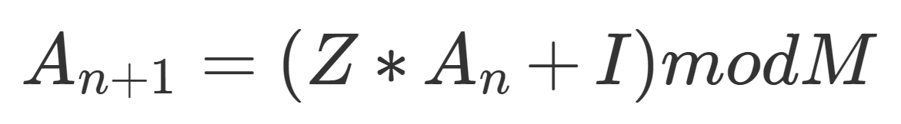

# numeros pseudoaleatorios
> Xn = (a * Xn-1 + b) % m

os numeros pseudoaleatórios são numeros que seguem de um um padrão que definirá uma sequência de resultados quase aleatórios (não são aleatorios pois dependem um dos outros), porém paracem ser. 
esses resultados são definidos por uma "seed" (semente) que é definida como Xn, onde n é o número de iterações; a, b ,m são constantes e o resultado de cada iteração define o novo valor de X
 
## a formula que define os numeros pseudoaleatórios é:

 

# video explicativo:
esta formula foi explicada e simplificada em um vídeo que postei no youtube, caso queira assistir <a href="https://youtu.be/x46BwfXxzC4">clique aqui</a>
